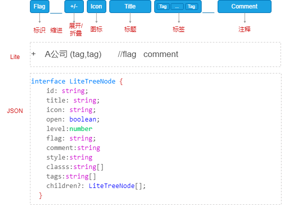

# 节点

## 节点结构

`LiteTree` 的节点是树的基本单元，它包含了节点的基本信息，以及节点的子节点。完整节点组成如下：




`LiteTree` 的节点由以下几部分组成：

- **前置标识**

可选的，长度为`1.2em`，用来显示一些特殊的标识，比如`+`、`-`、`*`等。

- **节点缩进**

用来表示节点的层级关系。默认一个`Tab`或`4`个空格代表一个树层级。


- **节点标题**

节点的标题，用来描述节点的内容。支持指定节点的`CSS`样式，也可以指定包含图标。


- **节点标签**

可选的，用来显示节点的标签，允许指定`1-N`个标签。

- **节点注释**

可选的，用来显示节点的注释，显示在最右侧。默认使用灰色显示。


## 数据格式

`LiteTree`支持`Lite`、`JSON`两种数据格式来描述树。

### Lite格式

`lite`是一种使用缩进来代表层级的简化格式，专门设计来描述树结构，类似`YAML`格式，每`4个空格`代表一个树层级，适合在`Markdown`文档中使用。

**`lite`特性如下：**

- 使用`4个空格`代表一个树层级。
- 由`变量声明区`和`树数据`两个区域，中间使用`---`分开。
- `变量声明区`用来声明嵌入样式、类样式、图标等信息，在节点中使用。
- `树数据`使用`4个空格`或`1个TAB`代表一个树层级，每一行代表一个节点。


```md
<LiteTree>
.red=color:red;
#bg=background-color:gray;border:1px solid #ccc;
ithub=data:image/svg+xml;base64,<...图标数据...>
---
根节点
    节点1
        节点1.1
        节点1.2
    节点2
        节点2.1
        节点2.2
    节点3
        节点3.1
        节点3.2
</LiteTree>
```

`lite`格式的节点数据使用`---`分开，前面部分是`变量声明区`，后面部分是`树数据区`。


#### 树数据

`LiteTree`的树数据结构类似`YAML`格式。

- `树数据`部分使用`4个空格`或`1个TAB`代表一个树层级，每一行代表一个节点。
- 节点标题前置的`+`、`-`用来表示节点的默认展开、折叠状态。（可选）
- 节点标题只能是单行数据，不支持多行数据。
- 节点标题后紧随`(tag,tag,tag)`用来表示节点的标签，支持多个标签。（可选）
- `//`紧随的代表的是节点的标识符
- `//`后面空白字符后面内容代表节点的注释，显示在最右侧。（可选）

#### 展开/折叠

- 前置`+`表示默认展开
- 前置`-`表示默认折叠

```ts
<LiteTree>
根节点
    + 节点1                     // 默认展开状态
        - 节点1.1
        - 节点1.2
    - 节点2                     // 默认折叠状态
        - 节点2.1   
        - 节点2.2
</LiteTree>
```

**渲染效果如下：**

<LiteTree>
根节点
    + 节点1                     // 默认展开状态
        节点1.1
        节点1.2
    - 节点2                     // 默认折叠状态
        节点2.1
        节点2.2
</LiteTree>

#### 标签

在节点标题后紧随`(tag,tag,tag)`用来表示节点的标签，支持多个标签。

- 多个标签之间使用`,`分隔
- 标签前可以指定`{...CSS样式...}`，用来指定标签的嵌入样式
- 标签内容也可以包含`[图标名]`

```ts
<LiteTree>
根节点
    节点1                     
        节点1.1(JavaScript,Go,C++)
        节点1.2
    节点2({color:white;background-color:#ff9e9e;border:1px solid red}A,{color:white;background-color:#9e9eff;border:1px solid blue}B,{color:white;background-color:#bfffbf;border:1px solid green}C)                     
        节点2.1
        节点2.2([tag]Github,Gitgee)
</LiteTree>
```

**渲染效果如下：**

<LiteTree>
根节点
    节点1                     
        节点1.1(JavaScript,Go,C++)
        节点1.2
    节点2({color:white;background-color:#ff9e9e;border:1px solid red}A,{color:white;background-color:#9e9eff;border:1px solid blue}B,{color:white;background-color:#bfffbf;border:1px solid green}C)                     
        节点2.1
        节点2.2([tag]Github,Gitgee)
</LiteTree>


####  注释

`//`后面内容代表节点的注释，显示在最右侧。

- 注释内容默认是灰色显示
- 注释内容可以包含`{...CSS样式...}`，用来指定注释的嵌入样式
- 注释内容也可以包含`[图标名]`
- 注意`// `后必须有空白字符

```ts
<LiteTree>
根节点
    节点1                     
        节点1.1 // 默认注释
        节点1.2 // {color:white;background-color:#ff9e9e;border:1px solid red}指定样式注释
    节点2                  
        节点2.1  // [tag]注释中[star]包含[yes]图标
        节点2.2  // 注释中包含超链接[点击:star](https://github.com/zhangfisher/voerka-i18n)
</LiteTree>
```

**渲染效果如下：**

<LiteTree>
根节点
    节点1                     
        节点1.1 // 默认注释
        节点1.2 // {color:white;background-color:#ff9e9e;border:1px solid red}指定样式注释
    节点2                  
        节点2.1  // [tag]注释中[star]包含[yes]图标
        节点2.2  // 注释中包含超链接[官网:star](https://github.com/zhangfisher/voerka-i18n)
</LiteTree>

#### 标识

紧随`//`后面内容代表节点的标识符，用来表示节点的特殊状态。

- 节点的标识符显示在节点头部区域，默认为`1.2em`宽度。所以一般只是用来显示一些简单字符或图标。
- 节点的标识符可以指定样式
- 包含一些内置节点标识，如`+`、`-`、`*`等
- 支持自定义节点标识


##### **内置标识**

`LiteTree`内置支持以下内置标识：
 
```ts
<LiteTree>
新增       //+     代表新增
删除       //-     代表删除
修改       //*      代表修改
强调       //!      代表强调
错误       //x      代表错误
成功       //v      代表成功
</LiteTree>
```

**渲染效果如下：**

<LiteTree>
新增       //+     代表新增
删除       //-     代表删除
修改       //*      代表修改
强调       //!      代表强调
错误       //x      代表错误
成功       //v      代表成功
</LiteTree>


##### 自定义标识

除了内置标识外，`LiteTree`也支持自定义标识,格式如下：

:::warning 格式说明
节点标题   **//**<`节点标识符`><`.节点样式类`><`{节点样式}`>
:::

- 标识标识字符必须尾随在`//`后，并且不能包含空格字符
- 可以为节点标识指定样式`CSS`类,如`//w.warning`代表节点应用`warning`样式类。
- 可以为节点标识指定`样式`，如`//e{color:red}`代表节点应用`color:red`样式。

**下面是一个例子：**

```md
.warning=color:#ff742e;background-color:#ffd0b3;
github=data:image/svg+xml;base64,<...此处省略自定义图标数据...>
---
成功       //s     代表成功
警告       //w.warning      代表警告
错误       //e{color:red}      代表错误
VoerkaI18n       //[github]{color:green}      使用图标标识
```

**渲染效果如下：**

<LiteTree>
.warning=color:#ff742e;background-color:#ffd0b3;
github=data:image/svg+xml;base64,PHN2ZyB4bWxucz0iaHR0cDovL3d3dy53My5vcmcvMjAwMC9zdmciIHdpZHRoPSIxZW0iIGhlaWdodD0iMWVtIiB2aWV3Qm94PSIwIDAgMjQgMjQiPjxwYXRoIGZpbGw9ImN1cnJlbnRDb2xvciIgZmlsbC1ydWxlPSJldmVub2RkIiBkPSJNMTEuOTk5IDFDNS45MjYgMSAxIDUuOTI1IDEgMTJjMCA0Ljg2IDMuMTUyIDguOTgzIDcuNTIzIDEwLjQzN2MuNTUuMTAyLjc1LS4yMzguNzUtLjUzYzAtLjI2LS4wMDktLjk1Mi0uMDE0LTEuODdjLTMuMDYuNjY0LTMuNzA2LTEuNDc1LTMuNzA2LTEuNDc1Yy0uNS0xLjI3LTEuMjIxLTEuNjEtMS4yMjEtMS42MWMtLjk5OS0uNjgxLjA3NS0uNjY4LjA3NS0uNjY4YzEuMTA1LjA3OCAxLjY4NSAxLjEzNCAxLjY4NSAxLjEzNGMuOTgxIDEuNjggMi41NzUgMS4xOTUgMy4yMDIuOTE0Yy4xLS43MS4zODQtMS4xOTUuNjk4LTEuNDdjLTIuNDQyLS4yNzgtNS4wMS0xLjIyMi01LjAxLTUuNDM3YzAtMS4yLjQyOC0yLjE4MyAxLjEzMi0yLjk1MmMtLjExNC0uMjc4LS40OTEtMS4zOTcuMTA4LTIuOTFjMCAwIC45MjMtLjI5NyAzLjAyNSAxLjEyN0ExMC41MzYgMTAuNTM2IDAgMCAxIDEyIDYuMzJhMTAuNDkgMTAuNDkgMCAwIDEgMi43NTQuMzdjMi4xLTEuNDI0IDMuMDIyLTEuMTI4IDMuMDIyLTEuMTI4Yy42IDEuNTE0LjIyMyAyLjYzMy4xMSAyLjkxMWMuNzA1Ljc2OSAxLjEzIDEuNzUxIDEuMTMgMi45NTJjMCA0LjIyNi0yLjU3MiA1LjE1Ni01LjAyMiA1LjQyOGMuMzk1LjM0Ljc0NyAxLjAxLjc0NyAyLjAzN2MwIDEuNDctLjAxNCAyLjY1Ny0uMDE0IDMuMDE3YzAgLjI5NS4xOTkuNjM3Ljc1Ni41M0MxOS44NTEgMjAuOTc5IDIzIDE2Ljg1OSAyMyAxMmMwLTYuMDc1LTQuOTI2LTExLTExLjAwMS0xMSIvPjwvc3ZnPg==
---
成功       //s{color:green}     代表成功
警告       //w.warning          代表警告
错误       //e{color:red}       代表错误
VoerkaI18n       //[github]{color:green}      使用图标标识
</LiteTree>


#### 变量声明

- 变量声明区使用`---`分开，用来声明嵌入样式、类样式、图标等信息，在节点中使用。
- 使用`#`开头的变量名，代表嵌入样式
- 使用`.`开头的变量名，代表类样式
- 其他变量，代表嵌入图标数据，一般使用`Data URL`格式，如`github=data:image/svg+xml;base64,<...图标数据...>`

**变量声明区声明的变量可以在后续的树数据中引用**


`LiteTree`允许在节点数据中定义上下文变量，声明树数据时，使用`---`分割上下文变量和树数据，以便在树中引用。

支持定义以下上下文变量：

- `样式`: 形如`#样式名称=css样式`
- `样式类`: 形如`.样式名称=css样式`
- `图标`: 形如`图标名称=<data:image/svg+xml;base64,<...图标数据...>>`


```mdx {2-5,7}
<LiteTree>
在此定义上下文变量
#<样式名称>=<样式值>
.样式类名=<样式值>
<图标名称>=<图标数据>
---   
在此定义树数据
</LiteTree>
```

**一个简单示例：**

```mdx
<LiteTree>
我的项目
    VoerkaI18n(#blue)  //{color:red;border:1px solid red;}
    speedform
    Logsets
    VoerkaLogger(#error) 
    FlexDecorators
    airplane
    ts
</LiteTree>
```

以上声明了5个上下文变量，分别是:

- 2个样式： `error`、`blue`
- 1个类：`tip`
- 2个图标: `airplane`、`ts`。

接下来我们在树数据中引用这些上下文变量。

```md {2,5,7}
<LiteTree>
// 声明样式
#cool=color:red;border: 1px solid red;background:#ffd2d2;padding:2px;
#blue=color:red;border: 1px solid blue;background:#e6e6ff;padding:2px;
// 声明样式类
.tip=border:1px solid;red;
// 声明嵌入式图标
airplane=data:image/svg+xml;base64,PHN2ZyB4bWxucz0iaHR0cDovL3d3dy53My5vcmcvMjAwMC9zdmciIHdpZHRoPSIxZW0iIGhlaWdodD0iMWVtIiB2aWV3Qm94PSIwIDAgMjU2IDI1NiI+PHBhdGggZmlsbD0iY3VycmVudENvbG9yIiBkPSJNMjM1LjU4IDEyOC44NEwxNjAgOTEuMDZWNDhhMzIgMzIgMCAwIDAtNjQgMHY0My4wNmwtNzUuNTggMzcuNzhBOCA4IDAgMCAwIDE2IDEzNnYzMmE4IDggMCAwIDAgOS41NyA3Ljg0TDk2IDE2MS43NnYxOC45M2wtMTMuNjYgMTMuNjVBOCA4IDAgMCAwIDgwIDIwMHYzMmE4IDggMCAwIDAgMTEgNy40M2wzNy0xNC44MWwzNyAxNC44MWE4IDggMCAwIDAgMTEtNy40M3YtMzJhOCA4IDAgMCAwLTIuMzQtNS42NkwxNjAgMTgwLjY5di0xOC45M2w3MC40MyAxNC4wOEE4IDggMCAwIDAgMjQwIDE2OHYtMzJhOCA4IDAgMCAwLTQuNDItNy4xNk0yMjQgMTU4LjI0bC03MC40My0xNC4wOEE4IDggMCAwIDAgMTQ0IDE1MnYzMmE4IDggMCAwIDAgMi4zNCA1LjY2TDE2MCAyMDMuMzF2MTYuODdsLTI5LTExLjYxYTggOCAwIDAgMC01Ljk0IDBMOTYgMjIwLjE4di0xNi44N2wxMy42Ni0xMy42NUE4IDggMCAwIDAgMTEyIDE4NHYtMzJhOCA4IDAgMCAwLTkuNTctNy44NEwzMiAxNTguMjR2LTE3LjNsNzUuNTgtMzcuNzhBOCA4IDAgMCAwIDExMiA5NlY0OGExNiAxNiAwIDAgMSAzMiAwdjQ4YTggOCAwIDAgMCA0LjQyIDcuMTZMMjI0IDE0MC45NFoiLz48L3N2Zz4=
ts=data:image/svg+xml;base64,PHN2ZyB4bWxucz0iaHR0cDovL3d3dy53My5vcmcvMjAwMC9zdmciIHdpZHRoPSIxZW0iIGhlaWdodD0iMWVtIiB2aWV3Qm94PSIwIDAgMTUgMTUiPjxwYXRoIGZpbGw9Im5vbmUiIHN0cm9rZT0iY3VycmVudENvbG9yIiBkPSJNMTIuNSA4di0uMTY3YzAtLjczNi0uNTk3LTEuMzMzLTEuMzMzLTEuMzMzSDEwYTEuNSAxLjUgMCAxIDAgMCAzaDFhMS41IDEuNSAwIDAgMSAwIDNoLTFBMS41IDEuNSAwIDAgMSA4LjUgMTFNOCA2LjVIM20yLjUgMFYxM00uNS41aDE0djE0SC41eiIvPjwvc3ZnPg==
---
我的项目
    VoerkaI18n({#blue}Cool)   
    Logsets
    VoerkaLogger(#error) 
    FlexDecorators
    airplane
    ts
</LiteTree>
```
**渲染效果如下：**

<LiteTree>
#cool=color:red;border: 1px solid red;background:#ffd2d2;padding:2px;
#blue=color:blue;border: 1px solid blue;background:#e6e6ff;padding:2px;
.tip=border:1px solid;color:red;
airplane=data:image/svg+xml;base64,PHN2ZyB4bWxucz0iaHR0cDovL3d3dy53My5vcmcvMjAwMC9zdmciIHdpZHRoPSIxZW0iIGhlaWdodD0iMWVtIiB2aWV3Qm94PSIwIDAgMjU2IDI1NiI+PHBhdGggZmlsbD0iY3VycmVudENvbG9yIiBkPSJNMjM1LjU4IDEyOC44NEwxNjAgOTEuMDZWNDhhMzIgMzIgMCAwIDAtNjQgMHY0My4wNmwtNzUuNTggMzcuNzhBOCA4IDAgMCAwIDE2IDEzNnYzMmE4IDggMCAwIDAgOS41NyA3Ljg0TDk2IDE2MS43NnYxOC45M2wtMTMuNjYgMTMuNjVBOCA4IDAgMCAwIDgwIDIwMHYzMmE4IDggMCAwIDAgMTEgNy40M2wzNy0xNC44MWwzNyAxNC44MWE4IDggMCAwIDAgMTEtNy40M3YtMzJhOCA4IDAgMCAwLTIuMzQtNS42NkwxNjAgMTgwLjY5di0xOC45M2w3MC40MyAxNC4wOEE4IDggMCAwIDAgMjQwIDE2OHYtMzJhOCA4IDAgMCAwLTQuNDItNy4xNk0yMjQgMTU4LjI0bC03MC40My0xNC4wOEE4IDggMCAwIDAgMTQ0IDE1MnYzMmE4IDggMCAwIDAgMi4zNCA1LjY2TDE2MCAyMDMuMzF2MTYuODdsLTI5LTExLjYxYTggOCAwIDAgMC01Ljk0IDBMOTYgMjIwLjE4di0xNi44N2wxMy42Ni0xMy42NUE4IDggMCAwIDAgMTEyIDE4NHYtMzJhOCA4IDAgMCAwLTkuNTctNy44NEwzMiAxNTguMjR2LTE3LjNsNzUuNTgtMzcuNzhBOCA4IDAgMCAwIDExMiA5NlY0OGExNiAxNiAwIDAgMSAzMiAwdjQ4YTggOCAwIDAgMCA0LjQyIDcuMTZMMjI0IDE0MC45NFoiLz48L3N2Zz4=
ts=data:image/svg+xml;base64,PHN2ZyB4bWxucz0iaHR0cDovL3d3dy53My5vcmcvMjAwMC9zdmciIHdpZHRoPSIxZW0iIGhlaWdodD0iMWVtIiB2aWV3Qm94PSIwIDAgMTUgMTUiPjxwYXRoIGZpbGw9Im5vbmUiIHN0cm9rZT0iY3VycmVudENvbG9yIiBkPSJNMTIuNSA4di0uMTY3YzAtLjczNi0uNTk3LTEuMzMzLTEuMzMzLTEuMzMzSDEwYTEuNSAxLjUgMCAxIDAgMCAzaDFhMS41IDEuNSAwIDAgMSAwIDNoLTFBMS41IDEuNSAwIDAgMSA4LjUgMTFNOCA2LjVIM20yLjUgMFYxM00uNS41aDE0djE0SC41eiIvPjwvc3ZnPg==
---
[airplane] 我的项目
    VoerkaI18n({#cool}Cool)  
    speedform
    {#blue}Logsets
    VoerkaLogger(#error) 
    FlexDecorators    // {.tip}装饰器
    airplane
    [{color:blue}ts]{color:blue}ts
</LiteTree>


### JSON格式

`JSON`格式是一种通用的数据格式，用来描述树结构，适合在`JavaScript`中使用。
但是在`Markdwon`中使用时比较繁琐，不推荐使用。

```ts
interface LiteTreeNode {
    id: string;
    title: string;
    icon: string;
    open: boolean;    
    level:number
    flag: '+' | '-' | '*' | '!' | 'x' | 'v'  | string;
    diff: '+' | '-' | '*' 
    comment:string
    style:string
    classs:string[]
    tags:string[]
    children?: LiteTreeNode[];
  }  
```
**注意**
为方便在`Markdown`场景下使用，`LiteTree`对支持的JSON数据格式作了一定的容错处理。

- `Key`允许不使用`"...."`包裹
- `Value`允许不使用`"...."`包裹
- 将`'....'`的字符串自动替换为`"...."`
- 对中文全角字符进行自动替换，如`，`自动替换为`,`。

如以下是不符合规范的`JSON`数据，因为其`Key`没有使用`"...."`包裹，但在`LiteTree`时可以正常解析的。这对在这与`Markdown`文档时特别方便，让文档更加简洁。

```js
{
  title: "根节点",
  children: [
    {
      title: "节点1"      
    },
    {
      title: "节点2"
    },
    {
      title: "节点3"
    }
  ]
}
```

<LiteTree json>
{
  title: "根节点",
  children: [
    {
      title: "节点1"      
    },
    {
      title: "节点2"
    },
    {
      title: "节点3"
    }
  ]
}
</LiteTree>


