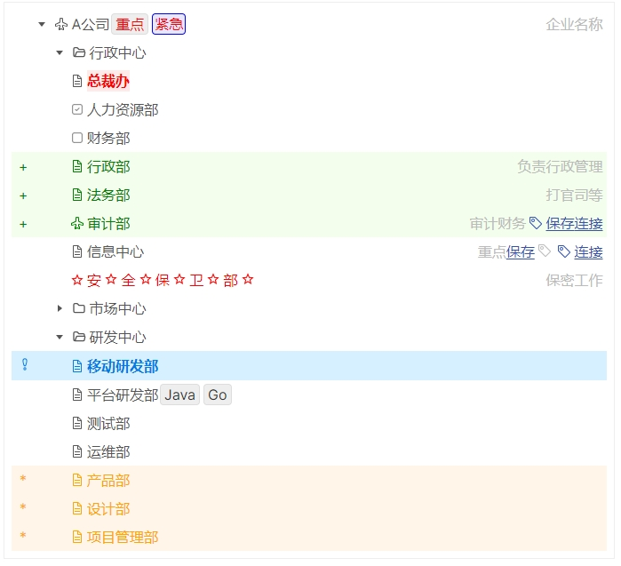

# vitepress-plugin-tree

Easy to render tree in VitePress.

[document](https://zhangfisher.github.io/repos/#lite-tree)

`vitepress-plugin-tree`是一个`Vue`组件，用于渲染树形结构。

## Installation

```bash
npm install vitepress-plugin-tree
// or
yarn add vitepress-plugin-tree
// or
pnpm add vitepress-plugin-tree
```

## Usage

### Step 1: Configuration

In `./vitepress/config.mts` config ：

```ts {5-9}
// ./vitepress/config.mts
import { defineConfig } from 'vitepress'

export default defineConfig({
  vue:{
    template: {                      
      compilerOptions: {
        whitespace: 'preserve'   
      }
    }
  }
})
```
 
### Step 2: Register the component

Register `LiteTree` as a global component so that it can be used anywhere.
 
```ts
// .vitepress/theme/index.js
import DefaultTheme from 'vitepress/theme'
import { LiteTree } from 'vitepress-plugin-tree'

/** @type {import('vitepress').Theme} */
export default {
  extends: DefaultTheme,
  enhanceApp({ app }) { 
    app.component('Tree'，LiteTree)
  }
}
```

## Step 3: Render a tree

In markdown file, use `Tree` component to render tree.
 
```vue
<Tree>
Root
    A
        A1
        A2
    B                         
        B1
        B2
</Tree>
```

**Use `4 spaces` or `1 TAB` to represent a tree level.**

## Example

```md
<LiteTree>
#error=color:red;border: 1px solid red;background:#ffd2d2;padding:2px;
#blue=color:red;border: 1px solid blue;background:#e6e6ff;padding:2px;
airplane=data:image/svg+xml;base64,PHN2ZyB4bWxucz0iaHR0cDovL3d3dy53My5vcmcvMjAwMC9zdmciIHdpZHRoPSIxZW0iIGhlaWdodD0iMWVtIiB2aWV3Qm94PSIwIDAgMjU2IDI1NiI+PHBhdGggZmlsbD0iY3VycmVudENvbG9yIiBkPSJNMjM1LjU4IDEyOC44NEwxNjAgOTEuMDZWNDhhMzIgMzIgMCAwIDAtNjQgMHY0My4wNmwtNzUuNTggMzcuNzhBOCA4IDAgMCAwIDE2IDEzNnYzMmE4IDggMCAwIDAgOS41NyA3Ljg0TDk2IDE2MS43NnYxOC45M2wtMTMuNjYgMTMuNjVBOCA4IDAgMCAwIDgwIDIwMHYzMmE4IDggMCAwIDAgMTEgNy40M2wzNy0xNC44MWwzNyAxNC44MWE4IDggMCAwIDAgMTEtNy40M3YtMzJhOCA4IDAgMCAwLTIuMzQtNS42NkwxNjAgMTgwLjY5di0xOC45M2w3MC40MyAxNC4wOEE4IDggMCAwIDAgMjQwIDE2OHYtMzJhOCA4IDAgMCAwLTQuNDItNy4xNk0yMjQgMTU4LjI0bC03MC40My0xNC4wOEE4IDggMCAwIDAgMTQ0IDE1MnYzMmE4IDggMCAwIDAgMi4zNCA1LjY2TDE2MCAyMDMuMzF2MTYuODdsLTI5LTExLjYxYTggOCAwIDAgMC01Ljk0IDBMOTYgMjIwLjE4di0xNi44N2wxMy42Ni0xMy42NUE4IDggMCAwIDAgMTEyIDE4NHYtMzJhOCA4IDAgMCAwLTkuNTctNy44NEwzMiAxNTguMjR2LTE3LjNsNzUuNTgtMzcuNzhBOCA4IDAgMCAwIDExMiA5NlY0OGExNiAxNiAwIDAgMSAzMiAwdjQ4YTggOCAwIDAgMCA0LjQyIDcuMTZMMjI0IDE0MC45NFoiLz48L3N2Zz4=
ts=data:image/svg+xml;base64,PHN2ZyB4bWxucz0iaHR0cDovL3d3dy53My5vcmcvMjAwMC9zdmciIHdpZHRoPSIxZW0iIGhlaWdodD0iMWVtIiB2aWV3Qm94PSIwIDAgMTUgMTUiPjxwYXRoIGZpbGw9Im5vbmUiIHN0cm9rZT0iY3VycmVudENvbG9yIiBkPSJNMTIuNSA4di0uMTY3YzAtLjczNi0uNTk3LTEuMzMzLTEuMzMzLTEuMzMzSDEwYTEuNSAxLjUgMCAxIDAgMCAzaDFhMS41IDEuNSAwIDAgMSAwIDNoLTFBMS41IDEuNSAwIDAgMSA4LjUgMTFNOCA2LjVIM20yLjUgMFYxM00uNS41aDE0djE0SC41eiIvPjwvc3ZnPg==
---
- [airplane]Company A({color:red;}Key,{#blue}Urgent)          //   Company Name
    Administrative Center
        {color:red;font-weight:bold;background:#ffeaea}President's Office
        [checked]Human Resources Department
        [unchecked]{.blue}Finance Department
        Administrative Department        //+  Responsible for administrative management
        Legal Department                //+  Litigation, etc.
        [airplane]Audit Department      //+  Audit finance[Save:tag](sss) [Link](sss)
        Information Center              // Key[Save](www.baidu.com)[tag][Link:tag](www.baidu.com)
        [star]Sec[star]ur[star]ity[star] and [star]Pro[star]tection[star] Department[star]                //{color:red}   Confidentiality work
    + Market Center    
        Marketing Department({#error}Error,"{#warning}Warning")
        Sales Department                //-
        Customer Service Department     //-
        {#blue}Brand Department         //   this is cool
        Market Planning Department      //!  Key
        Market Marketing Department     // {.blue}this is cool
    R&D Center
        Mobile R&D Department           //! 
        Platform R&D Department({success}Java,{error}Go)
        {.success}Testing Department
        Operations Department
        Product Department                //*
        Design Department                 //*
        Project Management Department     //*
</LiteTree>     

```

**Rendered effect:**




See [document](https://zhangfisher.github.io/repos/#lite-tree)


