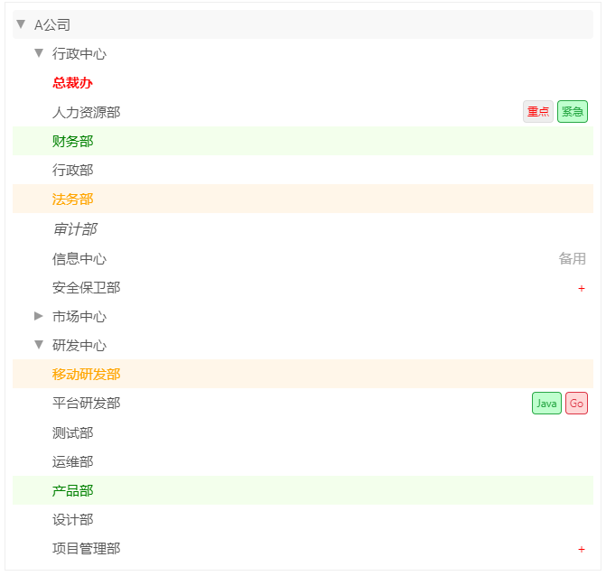

# LiteTree

[中文](./readme_CN.md)
[English](./readme.md)

`LiteTree`是一款非常简单的`vue`树组件，它的设计初衷是为了在`vitepress`上使用时可以比较方便地显示树形结构。

我们知道，`Vue`树组件非常多，一般情况下，但是在`vitepress`上使用这些组件时，会有一些问题，比如样式冲突、体积过大、功能太多等问题，这与`VitePress`这种以展示为主的场景显示格格不入。
特别是传递树数据时，一般是通过`props`传入的，这样在`vitepress`上使用时，就会显得非常麻烦。

所以，我开发了这款非常简单的`vue`树组件，它的特点是：

- 体积小，不依赖任何第三方库
- 样式简单，功能小巧
- 通过默认`slot`传递树数据，非常方便
- 树数据具备良好的容错性
- 支持自定义节点样式、标签、备注等


## 安装

```bash
npm install lite-tree
// or
yarn add lite-tree
// or
pnpm add lite-tree
```

## 使用方法

在`vitepress`中使用

```md
<script setup>
import Tree from 'lite-tree'
</script>

<Tree>
          {
        title: "A公司",
        expend: true,
        children:[          
          {
            title: "行政中心",
            children:[
              {title: "{color:red;font-weight:bold;}总裁办",mark:"success"},
              {title: "人力资源部",tags:['{color:red;}重点','{success}紧急']},
              {title: "财务部"},
              {title: "行政部",diff:'add'},
              {title: "法务部",diff:'add'},
              {title: "审计部",diff:'add'},
              {title: "信息中心",comment:"备用"},
              {title: "安全保卫部",comment:"{color:red}+",style:"font-size:16px;font-style:italic"} 
            ]
          },
          { 
            title: "市场中心",
            open:false,
            children:[
              {title: "市场部",mark:"info",tags:['{error}出错','{warning}警告']},
              {title: "销售部",diff:'delete'},
              {title: "客服部",diff:'delete'},
              {title: "品牌部",diff:"delete"},
              {title: "市场策划部"},
              {title: "市场营销部",comment:"好",tags:["{info}ddddd"]}
            ]
          },
          {
            title: "研发中心",
            children:[
              {title: "移动研发部",mark:"warning"},
              {title: "平台研发部",tags:["{success}Java","{error}Go"]},
              {title: "测试部"},
              {title: "运维部",prefix:"{color:red;}+"},
              {title: "产品部",mark:"success"},
              {title: "设计部",diff:"modify"},
              {title: "项目管理部",comment:"{color:red;}+",diff:"modify"}
            ]

          }
        ]
      }    
</Tree>

```

最终的渲染效果如下：



## 属性

- prefix:Boolean - 是否显示前缀
- diff:'add' | 'delete' | 'modify' - 是否显示差异

## 特性

### 树数据

 树数据直接声明在组件`Slot`，一般是`JSON`格式，但具备良好的容错性，如下：
 
```js
{
    title  : "A公司",         // 节点标题，显示用
    open   : true,            // 是否展开
    style  : "color:red",     // 节点CSS
    mark   : "success",       // 节点标记，取值为`success`、`info`、`warning`、`error`
    tags   : ["",...,""],     // 节点标签
    comment: "...",           // 节点注释
    prefix : "...",           // 节点前缀
    diff   : "add",           // 是否显示差异
    children:[
        // 子节点
    ]
}
```

 
### 数据容错性

标准`JSON`格式对格式要求比较严格，而`LiteTree`对数据格式进行了预处理，具有一定的容错性：

- 节点`Key`可以使用`"..."`或`'...'`包裹，也可以省略。
- 字符串`Value`可以使用`"..."`或`'...'`包裹
- 如果不小心漏掉了,号，也是可以补全的。

### 节点特征

每个节点具有以下特征：

- `comment`:  节点注释，显示在节点最后面
- `tags`:     节点标签，显示在节点最后面
- `prefix`:   节点前缀，显示在节点最前面
- `diff`:     节点差异，显示在节点最前面的+、-、*号
- `mark`:     节点标记，取值为`success`、`info`、`warning`、`error`，分别代表`成功`、`信息`、`警告`、`错误`。分别用不同的颜色渲染。


### 节点样式

节点的`style`可以用来为节点指定`css style`。
节点的`title`,`comment`,`prefix`,`mark`或`tags`也支持在字符串前置`{...}`包裹来声明`css`样式。
如`tags:["{color:red;font-weight:bold;}OK","{color:blue}+"]`代表`OK`为红色加粗，`+`为蓝色。

### 事件

暂不支持，因为本组件主要是用在`vitepress`静态页面中进行静态显示，所以目前不支持事件。


## 推荐

- [全流程一健化React/Vue/Nodejs国际化方案 - VoerkaI18n](https://zhangfisher.github.io/voerka-i18n/)
- [无以伦比的React表单开发库 - speedform](https://zhangfisher.github.io/speed-form/)
- [终端界面开发增强库 - Logsets](https://zhangfisher.github.io/logsets/)
- [简单的日志输出库 - VoerkaLogger](https://zhangfisher.github.io/voerkalogger/)
- [装饰器开发 - FlexDecorators](https://zhangfisher.github.io/flex-decorators/)
- [有限状态机库 - FlexState](https://zhangfisher.github.io/flexstate/)
- [通用函数工具库 - FlexTools](https://zhangfisher.github.io/flex-tools/)
- [小巧优雅的CSS-IN-JS库 - Styledfc](https://zhangfisher.github.io/styledfc/)
- [为JSON文件添加注释的VSCODE插件 - json_comments_extension](https://github.com/zhangfisher/json_comments_extension)
- [开发交互式命令行程序库 - mixed-cli](https://github.com/zhangfisher/mixed-cli)
- [强大的字符串插值变量处理工具库 - flexvars](https://github.com/zhangfisher/flexvars)
- [前端link调试辅助工具 - yald](https://github.com/zhangfisher/yald)
- [异步信号 - asyncsignal](https://github.com/zhangfisher/asyncsignal)
- [捆绑Vue组件CSS到JS的插件 - vite-plugin-vue-style-bundler ](https://github.com/zhangfisher/vite-plugin-vue-style-bundler)
- [Vue树组件 - LiteTree](https://github.com/zhangfisher/lite-tree)
